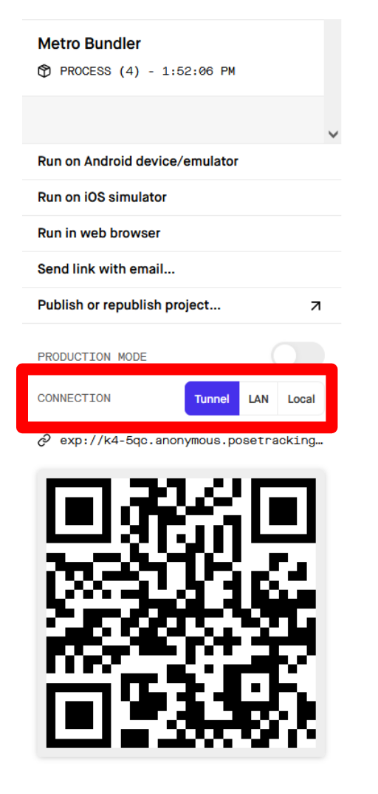

# Setup

#### Note: Before setting up on your computer, you will need to download the Expo Go app on your phone.

## For Windows:

### Clone repo
<code>git clone https://github.com/mageem2/poseTracking.git</code>

  
### Navigate to the 'poseTracking' project then run:
<code>npm install</code>

### Run The Code
<code>expo start</code>

- If there is an issue with running expo, namely something to do with the digital signature being unreadable, run:

  - <code>Set-ExecutionPolicy -Scope CurrentUser -ExecutionPolicy Unrestricted</code>

- Select either 'Yes' or 'Yes to All', and re-run the app.

#### After the expo start command is ran, web page will open up. From there, select the tunnel option. If this is your first time running the app, 'ngrok' will download. The tunnel option will need to be selected every time the app is ran.

#### Scan the QR code (A unique code will be generated every time the app is ran)

- For Android:
  - Open the Expo Go App and select "Scan QR Code".
  - 

- For iOS:
  - Open the Camera App and scanthe code. Expo Go will open automatically.

