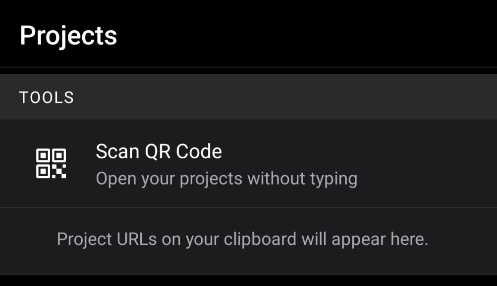

# Posetracker


A pose and exercise detection and classification component and system for React Native.


* ###### PoseTracker can compare live poses with poses that you train the classification model on. Notice the target pose compared to the pose done by the user. A keypoint-based skeleton and estimation framerate value (frames per second) can also be displayed for testing if specified by the developer.
* ###### PoseTracker can classify exercises. By utilizing pose classification, we track the user's sequences of poses. If a known exercise sequence is detected, we track the number of reps done by the user.

 ## Getting Started

PoseTracker is designed to be developed using the [Expo managed workflow](https://docs.expo.dev/introduction/managed-vs-bare/).

✅*There are a few easy ways to get started with posetracker*
*  Download our [npm package]('https://www.npmjs.com/package/posetracker') and start coding an exercise app using [Expo]('https://docs.expo.dev/').
*  Clone this repository and check out our example app by using the [Expo Go App]('https://expo.dev/client').

#### Note: Before setting up on your computer, you will need to download the Expo Go app on your phone.

### For Windows:

#### Clone repo
<code>git clone https://github.com/mageem2/poseTracking.git</code>

  
#### Navigate to the 'poseTracking' project then run:
<code>npm install</code>

 ### Prerequisites

😊 All you need is [Expo](https://docs.expo.dev/get-started/installation/) *and [Node LTS]('https://nodejs.org/en/') (for installing npm packages).*

```if the "npm -v" command works in terminal, then no need for Node LTS.```

[Expo](https://docs.expo.dev/get-started/installation/) is used to develop React Native Apps.

##### *2 downloads for developing w/ Expo*:
- 💻[*Expo CLI*]('https://docs.expo.dev/workflow/expo-cli/')
- 📱[*Expo GO App*]('https://expo.dev/client')

### Create a React Native App
[Initialize a React Native project using Expo](https://docs.expo.dev/get-started/create-a-new-app/).

1. *Run in terminal* - ```expo init my-app```
2. [Choose your template & workflow](https://docs.expo.dev/introduction/managed-vs-bare/).
- *We recommend the ***blank*** template. (managed workflow)*.
- ⚠*posetracker has ***not*** been tested on the bare workflow*.

#### Expo Development

```expo start```

- If there is an issue with running expo, namely something to do with the digital signature being unreadable, run:

    - Set-ExecutionPolicy -Scope CurrentUser -ExecutionPolicy Unrestricted
- Select either 'Yes' or 'Yes to All', and re-run the app.

### IDE / Code Editor
Edit your code in your favorite code editor. We use [Visual Studio Code](https://code.visualstudio.com/).

### ⚙ Required Configuration

#### Metro Configuration

This is required because we load the pose  classification model by using [bundleResourceIO](https://js.tensorflow.org/api_react_native/latest/#bundleResourceIO) from [tfjs-react-native](https://github.com/tensorflow/tfjs/tree/master/tfjs-react-native).

1. If you don't have a ```metro.config.js``` in the root directory of your React Native project, then create one.

2. Edit your ```metro.config.js``` to look like the following.

```js
const { getDefaultConfig } = require('metro-config');
module.exports = (async () => {
  const defaultConfig = await getDefaultConfig();
  const { assetExts } = defaultConfig.resolver;
  return {
    resolver: {
      // Add bin to assetExts
      assetExts: [...assetExts, 'bin'],
    }
  };
})();
```
#### Webpack Configuration
You will need this if you try to use ```npm run web```.

If you use expo and encounter a build failure when running npm run web due to You may need an appropriate loader to handle this file type... error, follow the steps below to make expo correctly transpile tfjs packages:

- Run: `expo customize:web`
  - Use the space key to select the `webpack.config.js` entry, then press "enter".
  - This will create a bare-minimum `webpack.config.js` file.
- Edit the `webpack.config.js` file as follows:

```
const createExpoWebpackConfigAsync = require('@expo/webpack-config');
module.exports = async function(env, argv) {
  const config = await createExpoWebpackConfigAsync(
      {
        ...env,
        babel: {
          dangerouslyAddModulePathsToTranspile: [
            // Ensure that all packages starting with @tensorflow are
            // transpiled.
            '@tensorflow',
          ],
        },
      },
      argv);
  return config;
};
```

### Installation

#### 📚 Install the posetracker NPM [package]('https://www.npmjs.com/package/posetracker'):
```python
npm install posetracker
```

## Usage

*posetracker* is a [React Native](https://reactnative.dev/) component library
)
- 📕 PoseTracker (detect and classify poses and exercises)
- 📘 PoseTrainer (train poses for tracking)

*Use Cases / Ways to use posetracker*:
- 🏋 Detecting and classifying exercises/movements.
- 🧘 Static pose detection and classification.

### 📕*PoseTracker* use
*PoseTracker* is the main component of the posetracker library. It has several uses:
- Load in the statically bundled ([bundleResourceIO](https://js.tensorflow.org/api_react_native/latest/#bundleResourceIO)) pose classification model, the known poses (```classes.json```), and the known exercises (```exercises.json```).
- *Live pose classification.* Returns this data to [callbacks](https://reactjs.org/docs/faq-functions.html)/outputs which can be used in an app. (listed in documentation)
- *Live exercise classification and rep counting*. Returns this data to [callbacks](https://reactjs.org/docs/faq-functions.html)/outputs which can be used in an app. (listed in documentation).
- Additional options (model server, internal state, classification tuning, and model configuration).

❗***Check docs or [Example App]() for detailed component use.***

#### 1. Import *PoseTracker*

```js
import { PoseTracker, PoseTrainer } from 'posetracker';

//These are likely needed too
import React, { useEffect, useState } from 'react';
import { StyleSheet, Text, View } from 'react-native';
```
#### 2. Make variables for handling props and callbacks.

- This requires ```useState``` which is why we imported it above.

```js
const [cameraType, setCameraType] = useState('front');
const [classifiedPoses, setClassifiedPoses] = useState(null);
const [classifiedPose, setClassifiedPose] = useState(["",0.00]); //This helps avoid rendering problems where
                                                                //the poseName can equal null
const [classifiedExercises, setClassifiedExercises] = useState(null);
const [classifiedExercise, setClassifiedExercise] = useState(null);
const [learnedPoses, setLearnedPoses] = useState(null);
const [learnedExercises, setLearnedExercises] = useState(null);
const [isDetecting, setIsDetecting] = useState(true);
const [isLoading, setIsLoading] = useState(true);
```
#### 3. Declare *PoseTracker* w/ props & callbacks
- For more info on *options*, look at docs or [below]().
- ⚠ Outputs ***must*** be included, or the app will break.
```js
<PoseTracker
      // Inputs/Props
      modelUrl={''}
      showFps={true}
      renderKeypoints={true}
      estimationModelType={"full"}
      cameraState={cameraType}
      estimationThreshold={0.5}
      classificationThreshold={5}
      resetExercises={false}
      autoRender={true}
      estimationSmoothing={true}
      undefinedPoseName={"UNDEFINED POSE"}
      undefinedExerciseName={"UNDEFINED EXERCISE"}
      classificationSmoothingValue={1}
      movementWindowResetLimit={20}

      // Outputs/Callbacks
      isDetecting={handleIsDetecting}
      isLoading={handleIsLoading}
      classifiedPoses={handleClassifiedPoses}
      classifiedPose={handleClassifiedPose}
      classifiedExercise={handleClassifiedExercise}
      classifiedExercises={handleClassifiedExercises}
      learnedPoses={handlePoseList}
      learnedExercises={handleExerciseList}
    />
```

#### 4. Handling outputs/callbacks
- The outputs from *PoseTracker* need to be used to make an exercise app, so we pass these variables to callback handlers.

```js
import { PoseTracker, PoseTrainer } from 'posetracker';
import React, { useEffect, useState } from 'react';
import { StyleSheet, Text, View } from 'react-native';

export default function App() {

  const [cameraType, setCameraType] = useState('front');
  const [classifiedPoses, setClassifiedPoses] = useState(null);
  const [classifiedPose, setClassifiedPose] = useState(["",0.00]); //This helps avoid rendering problems where
                                                                   //the poseName can equal null
  const [classifiedExercises, setClassifiedExercises] = useState(null);
  const [classifiedExercise, setClassifiedExercise] = useState(null);
  const [learnedPoses, setLearnedPoses] = useState(null);
  const [learnedExercises, setLearnedExercises] = useState(null);
  const [isDetecting, setIsDetecting] = useState(true);
  const [isLoading, setIsLoading] = useState(true);

  const handleClassifiedPose = (classified_pose) => {
      setClassifiedPose(classified_pose);
  }

  const handleClassifiedPoses = (classified_poses) => {
      setClassifiedPoses(classified_poses);
  }

  const handleClassifiedExercise = (classified_exercise) => {
      setClassifiedExercise(classified_exercise);
  }


  const handleClassifiedExercises = (classified_exercises) => {
      setClassifiedExercises(classified_exercises);
  }

  const handlePoseList = (learned_poses) => {
      setLearnedPoses(learned_poses);
  }

  const handleExerciseList = (learned_exercises) => {
      setLearnedExercises(learned_exercises);
  }

  const handleIsDetecting = (detecting) => {
      setIsDetecting(detecting);
  }

  const handleIsLoading = (loading) => {
      setIsLoading(loading);
  }

  const cameraTypeHandler = () => {
      if (cameraType === 'front') {
          setCameraType('back');
      } else {
          setCameraType('front');
      }
  }

  return (
    <PoseTracker
      //Inputs & Outputs not shown to save room
    />
  );
}
```

***For more *PoseTracker* use look at the docs or the [Example App]() in this repo.***.

### 📘*PoseTrainer* use

*PoseTrainer* is a component that is forked from the training component GitHub repository [motioncapture](https://github.com/Benthediver99/motioncapture).

🖧 *PoseTrainer* is used for training the pose classification model with a web server.
- 🧘 Train new poses or parts of pose sequences (exercises).
- 📷 Automatically send pose keypoint and name data to the inputted (PoseTrainer prop) web server URL.
- 📹 Stream multiple frames of data for quicker training by using the timed sender.

❗***Pose Training Requires Additional Setup and IS NOT internal*** - more information in docs or in [training section]().

## Demo App

- Type ``` expo start ``` in the command line
    - If there is an issue with running expo, namely something to do with the digital signature being unreadable, run:

        ``` Set-ExecutionPolicy -Scope CurrentUser -ExecutionPolicy Unrestricted ```
       
    - Select either 'Yes' or 'Yes to All', and re-run the app.

- After the expo start command is ran, web page will open up. If a web page doesn't open up, press 'd' in the terminal running Expo
- From there, select the tunnel option. If this is your first time running the app, 'ngrok' will download. The tunnel option will need to be selected every time the app is ran.


#### Scan the QR code (A unique code will be generated every time the app is ran)

- For Android:
  - Open the Expo Go App and select "Scan QR Code"

  

- For iOS:
  - Open the Camera App and scan the code. Expo Go will open automatically.

- App should look like this


## How App works
- Click on pose button (Tree Pose)
- Any other pose will show ‘Undefined’
- Tree Pose will be identified when the user does the correct pose


## PoseTracker Options

#### *Posetracker* I/O (Inputs & Outputs):

*Description:*
- ⇨ Inputs (props)
    - Model configuration
    - Tuning for classification
    - Buttons for internal state (camera,resetExercises)
    - Render testing elements (skeleton,fps/framerate)
- ⇦ Outputs (callbacks)
    - Handle loading/detecting states
    - Pose classification
    - Exercise classification
    - Learned poses/exercises

#### 🧰***PoseTracker*** examples and options:

*Check user guide or [Example App]() for more detailed use and descriptions.*
***➡ Inputs (props):***
- modelURL
    - URL serving tensor model for classification
    - default - Off.
    - If off, then classification model is bundled at compile time is used
    - For serving tensor models look [here](https://www.tensorflow.org/tfx/serving/serving_basic) or in the user guide.
___
- showFps
    - (true) renders an FPS display in the top-left of the classifier component
    - default - false
    - shows the FPS/latency of the pose estimation
___
- renderKeypoints
    - (true) renders the wireframe of the pose landmarks/keypoints detected by pose estimation
    - default - false
___
- estimationModelType
    - default - full
    - controls how accurate and fast the pose estimation model runs
    - model types:
        - lite: fast & inaccurate
        - full: mid & mid
        - heavy: slow & accurate
___
- estimationThreshold
    - minimum confidence value needed to do pose estimation for a frame.
___
- classificationThreshold
    - minimum confidence value needed to do pose classification for a frame.
___
- cameraState
    - Controls which camera is being used (front or back).
    - Can be used with a button for a camera flip functionality.
___
- resetExercises
    - if true then the classifiedExercises is reset on the next render.
    - Make sure this is only set to true for a short period of time or the exercise list will reset every frame.

***⬅ Outputs (callbacks):***
- isLoading
    - the callback function here will receive the isLoading state of the PoseClassifier component
    - this can be used to render your own "loading screen" components while pose estimation is loading
___
- isDetecting
    - the callback function here will receive the isDetecting state of the PoseClassifier component
    - this can be used to conditionally render an isDetecting screen or anything really
___
- classifiedPose
    - Return the highest confidence pose and it's confidence value
    - classifiedPose (Array):
    - Access current detected pose name:
        - classifiedPose[0]
    - Access current detected pose’s confidence value
        - classifiedPose[1]
    - ```js
        // --Array--
            // [pose_name, confidence value (negative or postive number)]
            // confidence value: more negative means less confident
            //  -this is a dynamic value which compares to other pose confidences
        ```
___
- classifiedPoses
    - This should return a JSON object of the poses and their confidences (decimal / percentage)
    - classifiedPoses (JSON object):
        ```js
            // Example Pose Object Structure
            // Object {
            //     "classifiedPoses": Array [
            //   Object {
            //     "confidence": 0.008087530732154846,
            //     "poseName": "t_pose",
            //   },
            //   Object {
            //     "confidence": -0.2243289351463318,
            //     "poseName": "tree",
            //   },
            //   Object {
            //     "confidence": -1.0932643413543701,
            //     "poseName": "warrior",
            //   },
            //     ],
       //}
        ```
    - Look at the [Demo App](#Demo App) for more examples on how to use this.

- classifiedExercise
    - Return the current classified exercise, its confidence value, and its rep count.
___
- classifiedExercises
- This returns a JSON object of the known exercises, their confidence values, and their rep count.
    - ```js
        Classified Exercises:  Object {
        "pushup": 0,
        "Tree-to-t": 0
        }
        ```
___
- learnedPoses
    - summary of the poses known by the classification model
    - This should return an array of the strings of poses which have been learned by the Pose Classifier
___
- learnedExercises
    - summary of the exercises saved in the exercise array
    - This should return an array of the strings of poses which have been learned by the Exercise Classifier
    - ```js
        Exercise Map:  Object {
        "31": "pushup",
        }
        ```


## 😊 FOR MORE INFORMATION LOOK AT THE USER GUIDE
